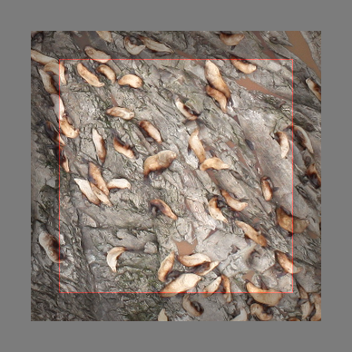
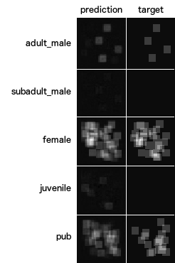

Sea Lion Counter
================

Authors: Robin Dinse, [Nico Lutz](https://github.com/nilutz)

This is the 37th place solution to the "NOAA Fisheries Steller Sea Lion Population Count" Kaggle Challenge. It is based on an [Inception-v4 network](https://arxiv.org/abs/1602.07261) (pre-trained on ImageNet; Szegedy et al., 2016) and [Count-ception](https://arxiv.org/abs/1703.08710) (Cohen et al., 2017). Our major change to Count-ception was to reduce the size of the targets to a much smaller resolution than the input using strided convolutions. Thereby we substantially reduced the memory and computation demands and time until convergence. Special care was taken to provide additional inputs to the network such that it can perceive of animals beyond the boundaries of the input image patches.

 

The network achieved an RMSE of around 8.4 on a validation set, but only around 19.5 on the test set. A main reason for that is possibly that the test set has on average a different scale than the training and validation sets and our model is unable to infer the scale from the input (e.g. from apparent sizes of features of the terrain) in order to achieve scale-invariance. This is particularily noticeable in the prediction of the classes `female` and `juvenile` which can mostly only be distinguished by size.
